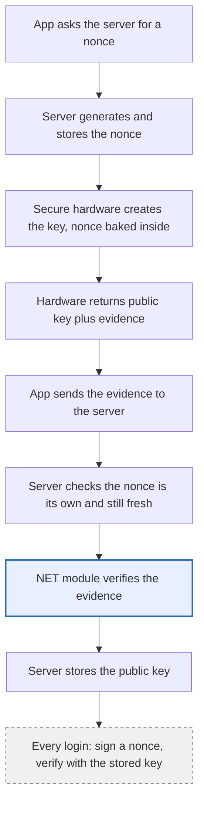
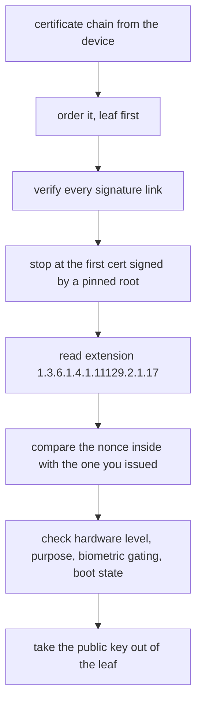
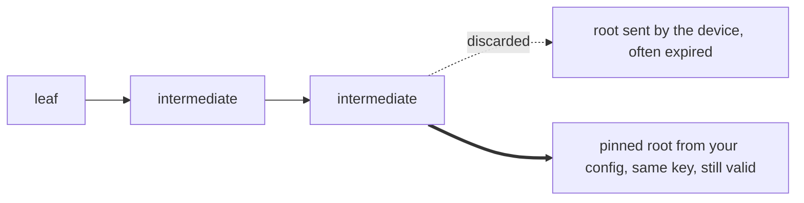
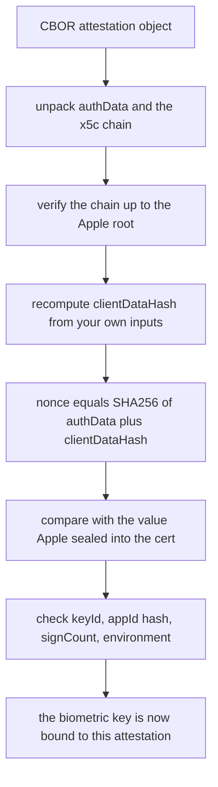
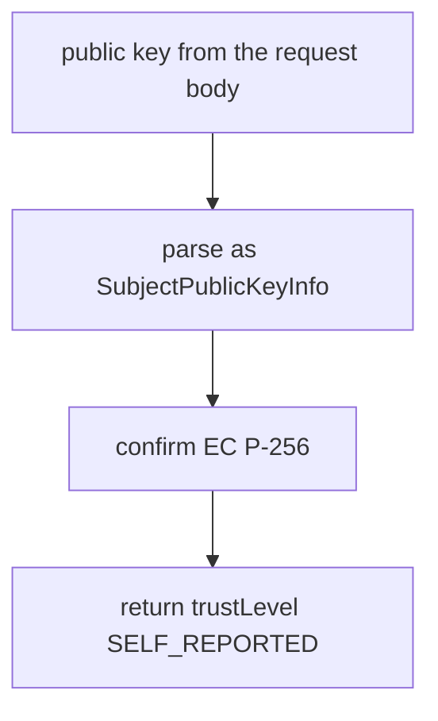

# Attestation verifier

Server side verification of Android Key Attestation and Apple App Attest, in C#.

Every check logs a line, so a rejection says which condition failed instead of
returning false. Targets `netstandard2.0` and `net8.0`.

## How it works



Steps 1 to 4 on the device. Step 5 is the network. Steps 6 to 8 on your server. The
blue box is the only place this library is called.

## The point

An app claiming "biometrics passed" is a boolean a hooking framework rewrites in one
line. So ask the hardware instead. It creates a biometric-gated key, the vendor
vouches for it, you store the public key, and every sensitive action then needs a
signature over a nonce you issued.

| | Attestation | Signature |
|---|---|---|
| Answers | was this key born in real hardware, in my real app | is this the same key, unlocked by biometrics, now |
| How often | once, at enrollment | every protected action |
| Checked against | a vendor root certificate | the stored public key |
| In this library | yes | no, that part is a one line ECDSA verify |

## Run it

```bash
dotnet build tools/VerifyCli/VerifyCli.csproj

dotnet tools/VerifyCli/bin/Debug/net8.0/verify-attestation.dll \
  chain.txt roots/GoogleAttestationRoots.pem <nonce> [package] [signing digest]
```

Exit 0 accepted, 1 rejected, 2 usage error. Pass `-` for the nonce to read it out of
the certificate without checking freshness.

`chain.txt` takes a JSON array, escaped `\n`, comma separated PEM, or plain PEM. All
four turn up in real logs.

## Android

Evidence is an X.509 chain. The leaf carries an extension describing the key.



```
1  at least two certificates
2  trust anchors loaded and not expired, empty value is a hard failure
3  ordered leaf first by issuer and subject, no assumption about length
4  each certificate signed by the next one
5  the walk stops at the first certificate signed by a pinned root
6  validity dates, for the certificates in the verified path only
7  extension 1.3.6.1.4.1.11129.2.1.17 present and parseable
8  attestationChallenge equals the nonce you issued
9  attestationSecurityLevel is TEE or StrongBox, never Software
10 origin is generated, not imported
11 purpose SIGN only, EC P-256, SHA-256
12 noAuthRequired absent, userAuthType includes biometrics, authTimeout absent
13 rootOfTrust: bootloader locked, verified boot state Verified
14 package name and signing digest match your configuration
15 public key extracted from the verified leaf
```

Steps 9 to 13 read the hardware enforced list only. The software enforced list is
written by the OS and proves nothing. One exception: `attestationApplicationId` comes
from the keystore daemon, not the app.

### The root the device sends is not a trust anchor



Older devices ship a factory root that has already expired. Plain X.509 path
validation rejects that whole generation. Drop the last certificate and anchor to your
own pinned copy. This is why the code does not use `X509Chain`.

## iOS

Evidence is a CBOR object. Android attestation describes the signing key. App Attest
describes the app and the device, and says nothing about your biometric key.

The clientDataHash is what ties them together.



```
clientDataHash = SHA256( challenge || publicKeyPem || deviceId || bundleId )
nonce          = SHA256( authData || clientDataHash )
```

Recompute clientDataHash yourself. Take it from the request body and the evidence
proves only that the app is genuine, with any key at all attached to it.

That concatenation is a contract. Change the order or add a newline on either side and
every enrollment fails with a nonce mismatch, which is miserable to debug.

```bash
dotnet tools/VerifyCli/bin/Debug/net8.0/verify-attestation.dll ios \
  input.json roots/AppleAppAttestRoot.pem <teamId.bundleId> <bundleId> [--production]
```

```json
{
  "attestationObjectBase64": "...",
  "appAttestKeyIdBase64":   "...",
  "nonceBase64":            "...",
  "publicKeyPem":           "-----BEGIN PUBLIC KEY-----\n...",
  "deviceId":               "..."
}
```

`appId` is `teamId.bundleId` and goes into the rpIdHash check. `bundleId` is the bundle
identifier alone and goes into the clientDataHash. Different values.

App Attest leaves live about three days, so stored samples fall outside their validity
window. The verifier warns rather than rejects. A live enrollment with an expired leaf
is a different matter, and the caller should fail it.

## Devices with no usable attestation

Huawei is the common case. SafetyDetect needs an entitlement that may not be granted,
and the keystore chain can terminate at the AOSP software attestation root, whose
private key is published in the Android source tree.



```bash
dotnet tools/VerifyCli/bin/Debug/net8.0/verify-attestation.dll key public.pem
```

Assurance drops and the output says so. The key binding survives: without the private
key an attacker still cannot sign your nonce, so a faked biometric callback authorises
nothing.

## Two traps

Take the public key from the certificate, never from the request body. Otherwise an
attacker replays somebody else's valid chain with their own software key, the chain
verifies, and you store the attacker's key.

Chain length and record version both vary. Devices used here sent three and four
certificates, with `attestationVersion` 3 on an Android 11 handset and 300 on an
Android 14 one. Five element chains exist. Anything that assumes `chain[3]` is the
root, or switches on version 3 alone, breaks on untested hardware.

## Make your own test chain

None are bundled: a chain carries the package name and signing digest of whoever
generated it.

```kotlin
val challenge = /* the nonce your server issued, base64 decoded */
val spec = KeyGenParameterSpec.Builder("demo_key", KeyProperties.PURPOSE_SIGN)
    .setDigests(KeyProperties.DIGEST_SHA256)
    .setAlgorithmParameterSpec(ECGenParameterSpec("secp256r1"))
    .setUserAuthenticationRequired(true)
    .setAttestationChallenge(challenge)
    .apply {
        if (Build.VERSION.SDK_INT >= Build.VERSION_CODES.R) {
            setUserAuthenticationParameters(0, KeyProperties.AUTH_BIOMETRIC_STRONG)
        }
        if (Build.VERSION.SDK_INT >= Build.VERSION_CODES.N) {
            setInvalidatedByBiometricEnrollment(true)
        }
    }
    .build()

KeyPairGenerator.getInstance(KeyProperties.KEY_ALGORITHM_EC, "AndroidKeyStore")
    .apply { initialize(spec) }
    .generateKeyPair()

val chain = KeyStore.getInstance("AndroidKeyStore")
    .apply { load(null) }
    .getCertificateChain("demo_key")
// write each certificate as PEM, concatenate, feed to the verifier
```

```bash
./test.sh chain.pem <the nonce you used> <your package name>
```

Six cases: valid chain, wrong nonce, wrong package, empty anchors, one root instead of
two, and a byte edited inside the leaf.

The bootloader has to be locked, otherwise the secure element downgrades itself to
software attestation and the chain correctly fails. No biometric prompt appears during
key creation, it comes at the first signature.

## Trust anchors

`roots/` holds both vendor roots, unchanged from the public downloads.

```bash
curl -s https://android.googleapis.com/attestation/root \
  | python3 -c "import json,sys; print('\n'.join(json.load(sys.stdin)))" \
  > roots/GoogleAttestationRoots.pem

curl -s https://www.apple.com/certificateauthority/Apple_App_Attestation_Root_CA.pem \
  > roots/AppleAppAttestRoot.pem
```

Google returns a JSON array, not PEM. Both Google roots are needed: RSA covers factory
provisioned keys on older devices, EC covers Remote Key Provisioning on newer ones.
Load one and the devices covered by the other are rejected.

```
Google root 1  CE:DB:1C:B6:DC:89:6A:E5:EC:79:73:48:BC:E9:28:67:53:C2:B3:8E:E7:1C:E0:FB:E3:4A:9A:12:48:80:0D:FC
Google root 2  6D:9D:B4:CE:6C:5C:0B:29:31:66:D0:89:86:E0:57:74:A8:77:6C:EB:52:5D:9E:43:29:52:0D:E1:2B:A4:BC:C0
Apple root     1C:B9:82:3B:A2:8B:A6:AD:2D:33:A0:06:94:1D:E2:AE:4F:51:3E:F1:D4:E8:31:B9:F7:E0:FA:7B:62:42:C9:32
```

## Not included

Revocation. Roots say who issued a certificate, not whether it is still trusted. Google
lists compromised attestation keys, currently around 1700 entries, mostly
`KEY_COMPROMISE`. Check every serial in the chain against
`https://android.googleapis.com/attestation/status`.

It sits outside because it is a live HTTP call with its own caching and failure modes,
and everything else here is offline arithmetic. Someone who extracted a key from one
device can mint valid chains on a laptop forever, and that list is the only thing that
stops them.

Also outside, belonging to whatever calls this: challenge lookup and expiry, single use
enforcement, lockout counters, storing the key.

## Files

| File | What it does |
|---|---|
| `AndroidAttestationVerifier.cs` | Android entry point, the fifteen checks in order |
| `IosAppAttestVerifier.cs` | Apple entry point, CBOR and the clientDataHash binding |
| `BiometricKeyValidator.cs` | fallback for devices with no usable attestation |
| `CertificateChain.cs` | ordering, path building, signature verification by hand |
| `KeyDescription.cs` | ASN.1 of the Android attestation extension |
| `Pem.cs` | PEM reader that accepts all four shapes seen in logs |
| `PublicKeyReader.cs` | SubjectPublicKeyInfo to ECDsa |
| `SubjectPublicKeyInfoBuilder.cs` | the reverse, both exist because .NET Framework lacks them |
| `tools/VerifyCli/` | console runner, three modes |
| `test.sh` | one chain plus five negative cases |

Around 2000 lines. Two NuGet packages, both Microsoft, both for parsing. No dependency
injection, no single-implementation interfaces, no factories.

## References

- <https://developer.android.com/privacy-and-security/security-key-attestation>
- <https://developer.apple.com/documentation/devicecheck/validating-apps-that-connect-to-your-server>
- <https://android.googlesource.com/platform/external/keyattestation/>

## License

MIT.
